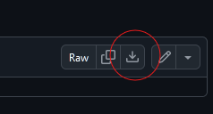
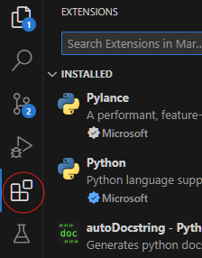
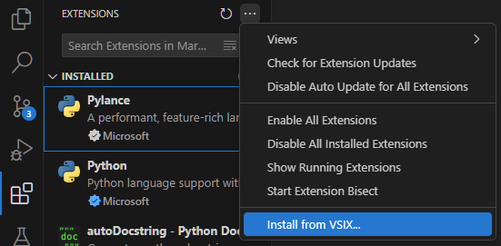

<h1>
	<picture>
	  <source media="(prefers-color-scheme: dark)" srcset="./media/icons/research-svgrepo-com-white.svg">
	  
	</picture>
	Search Master | Visual Studio Code
	 
</h1>

	
	&nbsp; 
	&nbsp; 
  

## Contents
1. [Installation](#installation)
2. [Usage](#usage)
	- [Searching](#searching)
		- [Exact Matches](#exact-matches)
		- [Fuzzy Matches](#fuzzy-matches)
		- [Results](#results)

## Installation
<!-- The link below should be updated if the extension file name changes -->
1. Firstly, download the [extension file](./search-master-0.0.1.vsix):

2. Open VS Code and navigate to the extensions panel:

3. Click on the ellipses for more actions, select __Install from VSIX__ and select the extension file from step 1:

## Usage

### Searching

#### Exact Matches
To search for exact matches, type the search term in the text box, and hit search

#### Fuzzy Matches
Fuzzy (inexact) matches can be found by adjusting the edit distance of the search (the number dropdown next to the text box); the greater the edit distance, the greater the degree of allowed inexactness.

> [!NOTE]
> Edit distance measures how many changes (insertions, deletions, or substitutions) are needed to transform one string into another:
>
> For instance, the edit distance between the strings "hello" and "jello" is 1, where they only differ by the substitution of the letter "j" or "h".

#### Results
- Results in a file are ranked in order of increasing edit distance to make finding closer matches easier.
- Selecting a result will open the corresponding document to the highlighted match.
